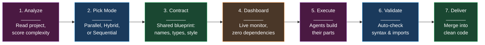
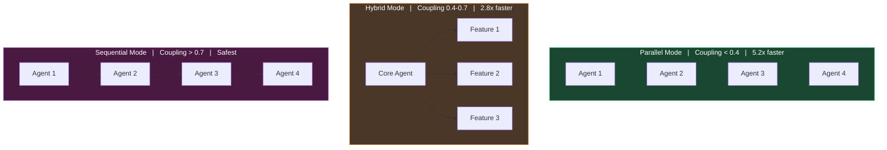
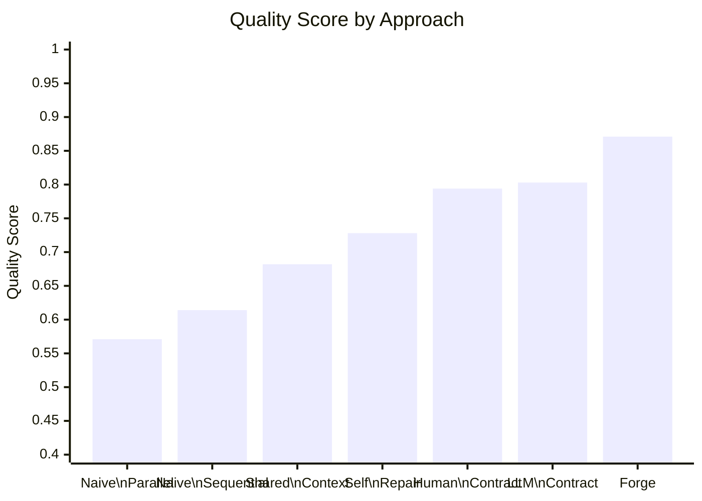
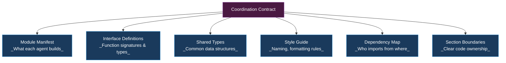

<div align="center">


# Forge

**Make AI agents actually work together.**


</div>

---

## What is Forge?

When multiple AI agents build something together, they fail. One writes `processPayment()`, another expects `handlePayment()`. Nothing fits.

**Forge gives every agent a shared contract before they start**, so their code works together on the first try.

---

## How it works



---

## Three modes

Forge picks the right one based on how connected your modules are.



---

## Results

Tested across 400+ experiments.



| What we measured | Result |
|-----------------|--------|
| Quality improvement | **+52.5%** (0.571 to 0.871) |
| Speed in parallel mode | **5.2x** faster |
| Errors caught automatically | **97%** (vs 58% manual) |
| Scaling to 16 agents | **8%** error increase (vs 340% without contracts) |

---

## What's in the contract?

The contract is the key idea. Before any agent writes code, Forge generates this:



---

## Quick start

```bash
forge build project.yaml
```

That's it. Forge handles everything.

---

## Docs

| Document | What's in it |
|----------|-------------|
| [SKILL.md](SKILL.md) | Full protocol spec |
| [Architecture](docs/ARCHITECTURE.md) | How the 7 phases work |
| [Experiments](docs/EXPERIMENTS.md) | All 400+ experiment data |
| [Agent Roles](docs/AGENT-ROLES.md) | 15+ agent types |
| [REST API Example](examples/rest-api-example.md) | Worked example |

---

## License

MIT

---

<div align="center">


**HappyCapy Research**

</div>
