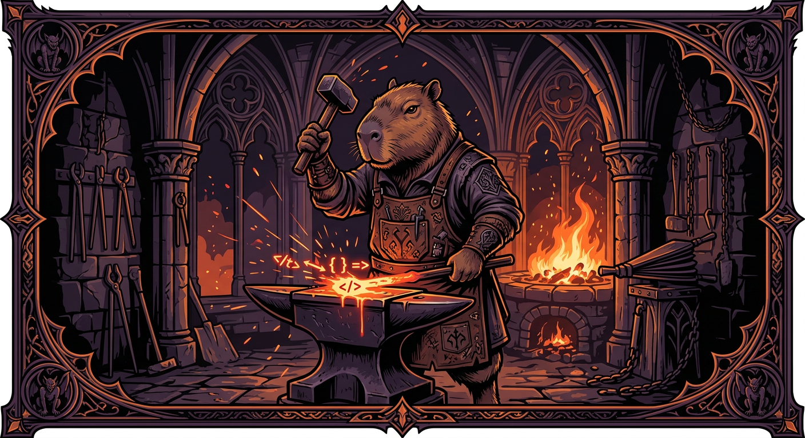
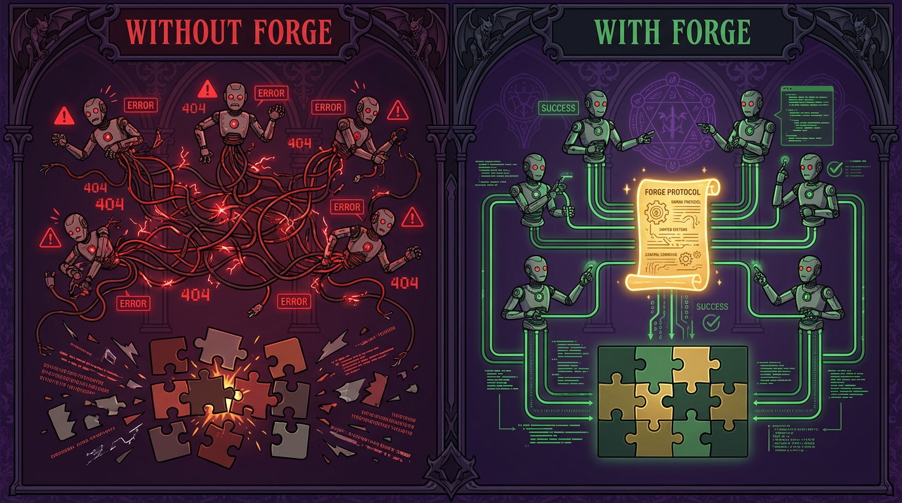
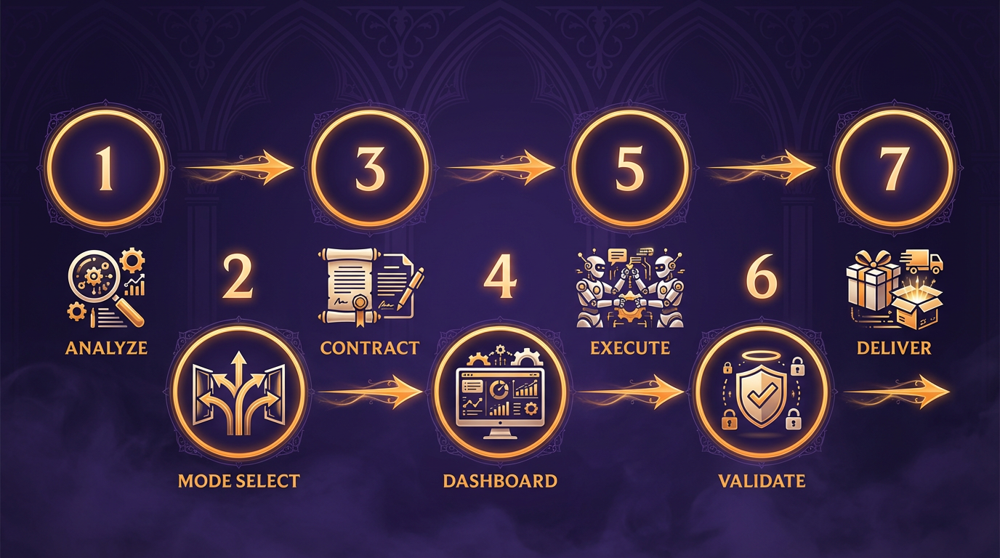
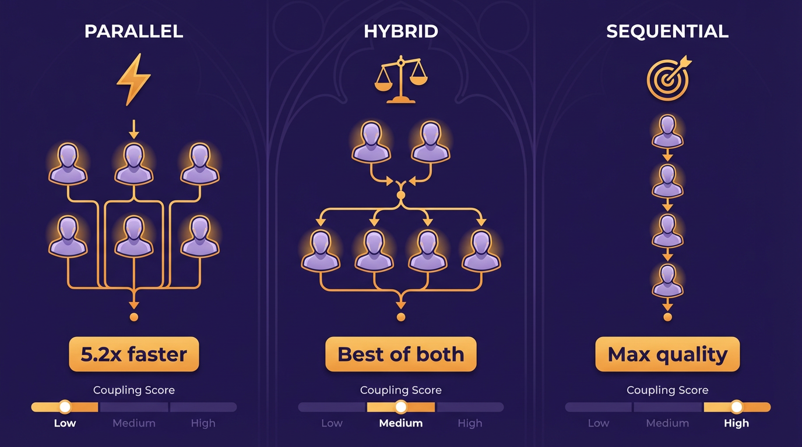
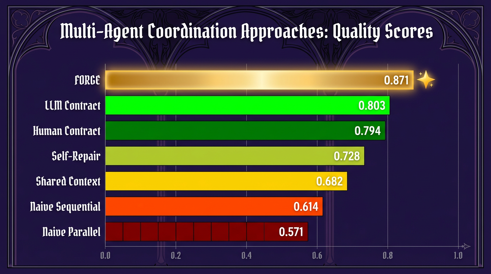

<div align="center">



# Forge

**Make AI agents actually work together.**


</div>

---

## What is Forge?

When you ask multiple AI agents to build something together, they fail. One agent writes `processPayment()`, another expects `handlePayment()`. One uses camelCase, another uses snake_case. Nothing fits.

**Forge fixes this.** It gives every agent a shared contract before they start coding, so their code works together on the first try.

<div align="center">

</div>

---

## How it works

Seven steps. Fully automated.

<div align="center">

</div>

| Step | What happens |
|------|-------------|
| **Analyze** | Reads your project, figures out what needs to be built |
| **Mode Select** | Picks the best strategy based on how connected your modules are |
| **Contract** | Writes a shared blueprint: function names, types, imports, style rules |
| **Dashboard** | Launches a live monitor so you can watch agents work |
| **Execute** | Agents build their parts following the contract |
| **Validate** | Auto-checks everything: syntax, imports, naming, completeness |
| **Deliver** | Merges it all into clean, ready-to-use code |

---

## Three modes

Forge picks the right one automatically.

<div align="center">

</div>

| Mode | When | Speed |
|------|------|-------|
| **Parallel** | Modules don't depend on each other | 5.2x faster |
| **Hybrid** | Some shared foundation, then independent features | 2.8x faster |
| **Sequential** | Everything depends on everything | Safest |

---

## Results

Tested across 400+ experiments. Not theory -- measured.

<div align="center">

</div>

| What we measured | Result |
|-----------------|--------|
| Quality improvement | **+52.5%** (0.571 to 0.871) |
| Speed in parallel mode | **5.2x** faster |
| Errors caught automatically | **97%** (vs 58% manual) |
| Scaling to 16 agents | **8%** error increase (vs 340% without contracts) |

---

## Quick start

```bash
forge build project.yaml
```

That's it. Forge handles analysis, contracts, agent selection, execution, validation, and delivery.

---

## Docs

| Document | What's in it |
|----------|-------------|
| [SKILL.md](SKILL.md) | Full protocol specification (1956 lines) |
| [Architecture](docs/ARCHITECTURE.md) | How the 7 phases work internally |
| [Experiments](docs/EXPERIMENTS.md) | All 400+ experiment details and data |
| [Agent Roles](docs/AGENT-ROLES.md) | The 15+ specialized agent types |
| [REST API Example](examples/rest-api-example.md) | Worked example: task management API |

---

## License

MIT

---

<div align="center">


**HappyCapy Research**

</div>
